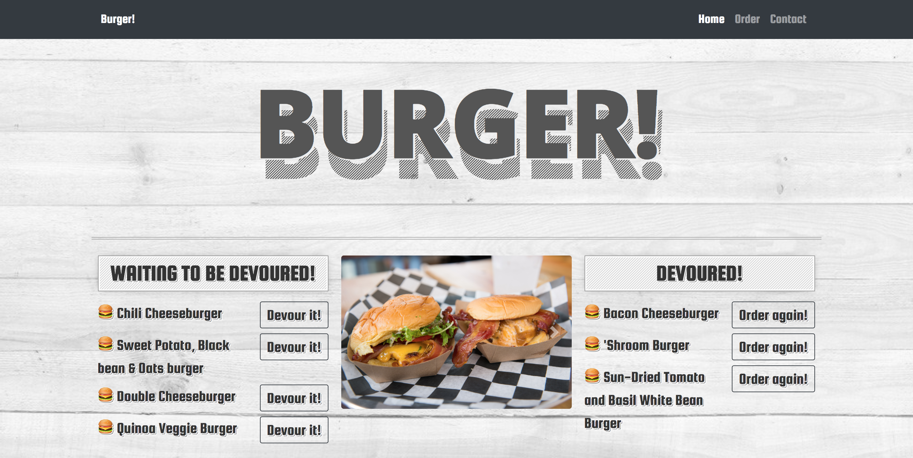
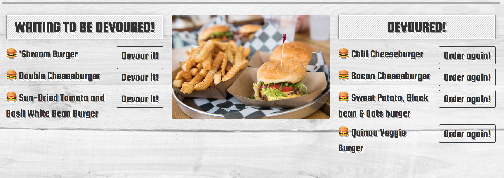
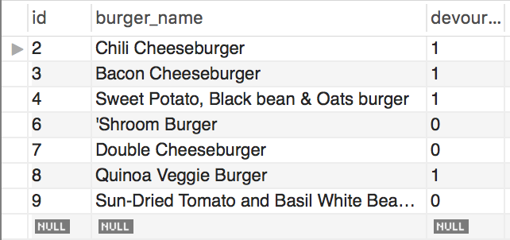

# Eat the Burger!

A burger logger utilizes MySQL, Express, and Handlebars to allow users to create, update, and read burgers from the database.
---
A working version of the application can be found at [https://fierce-island-73401.herokuapp.com](https://fierce-island-73401.herokuapp.com/  "Eat the Burger!")

---
## Technologies used
* `MySQL`
* `Node`
* `Express`
* `Handlebars`
* A homemade `ORM` (yum!)

---
## How this App works


* Each burger in the waiting area also has a `Devour it!` button. When the user clicks it, the burger will move to the right side of the page.


* The user can input the names of burgers they'd like to eat.


* Whenever a user submits a burger's name, the app will display the burger on the left side of the page -- waiting to be devoured.


* The app will store every burger in a database, whether devoured or not.

---
## Code Block
```
// Set up MySQL connection.
const mysql = require("mysql");
let connection;

if (process.env.JAWSDB_URL) {
    connection = mysql.createConnection(process.env.JAWSDB_URL)
    } else {
    // Dependencies
    require('dotenv').config();
    connection = mysql.createConnection({
        host: 'localhost',
        port: 3306,
        user: 'root',
        password: process.env.DATABASE_PASSWORD,
        database: "burgers_db"
    })
}
```
### Connecting your project to remote database using `JawsDB MySQL` extension
In your `connection.js` (or whichever file you created your MySQL connection), add the code shown above. 

Notice how `process.env.JAWSDB_URL` lets us plug in your connection details with just one object property. When you set up the `JawsDB` provision, `Heroku` saved the connection info in an environmental variable. Your Heroku app can reference this variable, hence the if-else statement:
    * If the server contains the `JAWSDB_URL environmental variable`, it connects to the `JawsDB database`.
    * If the server lacks the variable, it falls back on an explicitly defined `local database`.
    * You can upload this file to GitHub without worrying about a user finding your remote connection credentials since that info is hidden in the environmental variable.


## Author

[Keen Wilson](https://keenwilson.com "Keen Wilson's Portfolio")
